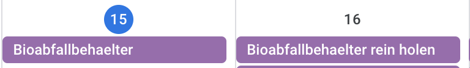
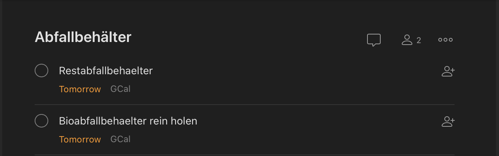

# WasteContainer-calendar-editor
This tool updates the .ics file provided by BonnOrange (https://www.bonnorange.de/abfuhrtermine.html) to create a new .ics for the next day.
As a result there are two .ics files. One for the exhibition dates and one for the dates to put the container back in.

I also enabled the todoist integration to google calendar, where i imported both .ics files. 
That way i get the approriate todos in todoist whenever i need to interact with a waste container.

The tool edits the following fields
* DTSTART;VALUE=DATE:<time> 
* DTEND;VALUE=DATE:<time>
* DESCRIPTION;LANGUAGE=de:<Description>
* SUMMARY;LANGUAGE=de:

* UID:<generated UUID>
  
# Screenshots

